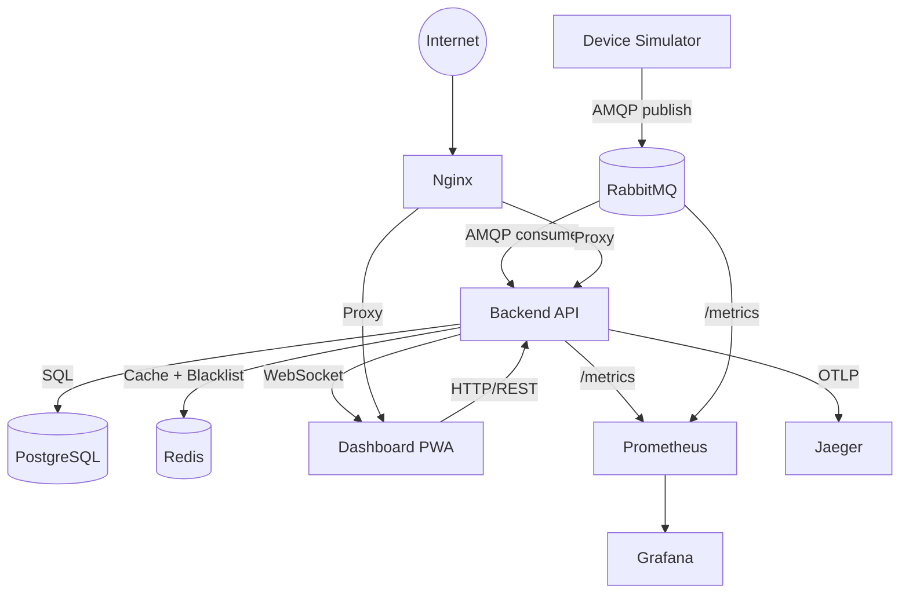

# SmartAccess IoT Platform

Sistema de monitoreo de dispositivos IoT en tiempo real basado en Event-Driven Architecture (EDA). Procesa eventos de dispositivos simulados con resiliencia, idempotencia y trazabilidad completa.

## Stack

| Componente | Tecnología |
|-----------|-----------|
| Backend | Node.js + TypeScript (Monolito Modular) |
| Message Broker | RabbitMQ (AMQP) |
| Base de Datos | PostgreSQL 14+ |
| Cache | Redis 7+ |
| Frontend | Next.js (PWA) |
| Device Simulator | Node.js + TypeScript |
| Tiempo Real | WebSockets |
| Proxy Reverso | Nginx |
| Observabilidad | Prometheus + Grafana + Jaeger |
| Contenedores | Docker (Distroless) + Docker Compose |
| CI/CD | GitHub Actions |

## Arquitectura



**Patrones clave:** ACK Manual, Retry + DLQ, Idempotencia, Outbox Pattern, Unit of Work, State Machine, Observer, Factory, Repository.

## Quick Start

```bash
# 1. Copiar variables de entorno
cp .env.example .env

# 2. Levantar todos los servicios
docker compose up -d

# 3. Verificar
docker compose ps
curl http://localhost/api/health
```

## Servicios

| Servicio | Puerto | Descripción |
|----------|--------|------------|
| Nginx | 80 | Proxy reverso (API + Dashboard + WS) |
| Backend API | 3000 (interno) | API REST + WebSocket + Consumer AMQP |
| Dashboard | interno | Next.js PWA (accesible vía Nginx) |
| Simulator | — | Generador de eventos IoT simulados |
| PostgreSQL | 5432 (interno) | Base de datos (10 tablas) |
| RabbitMQ | 15672 | Broker de mensajes (Management UI) |
| Redis | 6379 (interno) | Cache + Token Blacklist + Rate Limiting |
| Prometheus | 9090 | Recolector de métricas |
| Grafana | 3001 | Dashboards de observabilidad |
| Jaeger | 16686 | Distributed Tracing UI |

## Seguridad

El sistema implementa **6 capas de seguridad**:

| Capa | Implementación |
|------|---------------|
| Tokens | Encriptados con ChaCha20-Poly1305 + HKDF (PASETO-inspired) |
| Cookies | HttpOnly + SameSite=Strict + Secure |
| CSRF | Double-Submit Cookie Pattern |
| Passwords | Scrypt (Node.js crypto nativo) |
| Revocación | Redis Token Blacklist con TTL |
| Contenedores | Distroless, `read_only`, Docker Secrets, resource limits |

Ver detalle completo en [`docs/technical/07_security.md`](docs/technical/07_security.md).

## Testing

```bash
# Unit Tests (sin Docker, 39 tests)
cd backend && npx vitest run src/application/services/__tests__/ --reporter=verbose

# Integration Tests (con o sin Docker, 57 tests)
cd backend && npx vitest run src/__tests__/integration/ --reporter=verbose

# Todos los tests del backend
cd backend && npm test
```

**Suite completa:** 13 archivos de test, 92+ tests (39 unit + 53 integration).

## Docker Hardening

Todos los contenedores están fortificados:

- **`read_only: true`** — Sistema de archivos inmutable
- **Docker Secrets** — Credenciales vía `/run/secrets/` en vez de env vars
- **Resource Limits** — CPU y RAM limitados por servicio
- **`tmpfs`** — Solo carpetas temporales en RAM

Ver detalles en [`docs/adr/004-container-hardening.md`](docs/adr/004-container-hardening.md).

## Decisiones Arquitectónicas (ADRs)

| # | Decisión | Status |
|---|----------|--------|
| [001](docs/adr/001-token-encryption.md) | Token encryption con ChaCha20-Poly1305 | Accepted |
| [002](docs/adr/002-password-hashing.md) | Password hashing con Scrypt nativo | Accepted |
| [003](docs/adr/003-dead-letter-strategy.md) | Dead Letter Queue con persistencia | Accepted |
| [004](docs/adr/004-container-hardening.md) | Container hardening (Distroless + read_only) | Accepted |
| [005](docs/adr/005-e2e-testing-pivot.md) | E2E testing pivot a unit + integration | Accepted |

## Documentación

Toda la documentación del proyecto se encuentra en el directorio `docs/`:

- `docs/technical/` — Arquitectura, patrones de diseño, data dictionary, testing, seguridad
- `docs/product/` — Definición de producto, PRD, arquitectura de información
- `docs/domain/` — Reglas de negocio
- `docs/operations/` — Infraestructura, observabilidad, deployment, auditoría
- `docs/governance/` — Ética, cumplimiento
- `docs/collaboration/` — Git workflow, coding standards, setup
- `docs/adr/` — Architectural Decision Records
