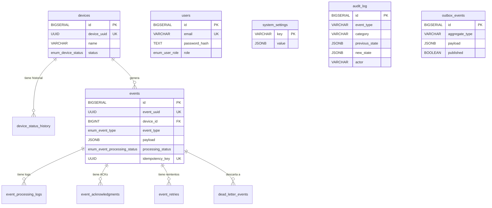

# Diccionario de Datos — SmartAccess IoT Platform

> **Dominio:** Plataforma IoT de Control de Acceso Inteligente — Event-Driven Architecture  
> **DBMS:** PostgreSQL 16+  
> **Esquema:** `public`  
> **Encoding:** UTF-8 · Collation: `en_US.UTF-8` · Timezone: UTC  
> **Normalización:** Tercera Forma Normal (3NF)  
> **Nomenclatura:** `snake_case`

---

## 1. Tipos Enumerados

### 1.1 `enum_device_status`

| Valor | Descripción |
|---|---|
| `REGISTERED` | Dispositivo registrado pero aún no conectado |
| `ONLINE` | Dispositivo conectado y reportando telemetría |
| `OFFLINE` | Dispositivo desconectado (normal o por timeout) |
| `ERROR` | Dispositivo en estado de error |
| `MAINTENANCE` | Dispositivo en mantenimiento programado |
| `DECOMMISSIONED` | Dispositivo dado de baja permanentemente (estado terminal) |

### 1.2 `enum_event_type`

| Valor | Descripción |
|---|---|
| `DEVICE_CONNECTED` | Un dispositivo se conectó a la plataforma |
| `DEVICE_DISCONNECTED` | Un dispositivo se desconectó |
| `TELEMETRY_REPORTED` | Un dispositivo reportó métricas de telemetría |
| `ALERT_TRIGGERED` | Una métrica superó un umbral configurado |
| `COMMAND_RECEIVED` | Un comando fue recibido por un dispositivo |
| `COMMAND_EXECUTED` | Un comando fue ejecutado por un dispositivo |

### 1.3 `enum_event_processing_status`

| Valor | Descripción |
|---|---|
| `RECEIVED` | Evento recibido del broker, pendiente de validación |
| `VALIDATED` | Evento validado estructuralmente |
| `PROCESSED` | Evento procesado exitosamente |
| `FAILED` | Procesamiento fallido |
| `RETRY_PENDING` | Reintento programado |
| `DEAD_LETTERED` | Evento enviado al DLQ tras agotar reintentos |

### 1.4 `enum_ack_status`

| Valor | Descripción |
|---|---|
| `PENDING` | ACK pendiente de envío al broker |
| `ACKED` | Mensaje confirmado exitosamente |
| `NACKED` | Mensaje rechazado, será reencolado |
| `TIMEOUT` | No se recibió respuesta dentro del plazo |

### 1.5 `enum_user_role`

| Valor | Descripción |
|---|---|
| `ADMIN` | Acceso total: gestión de usuarios, configuración, auditoría |
| `OPERATOR` | Gestión operativa de dispositivos y alertas |
| `VIEWER` | Solo lectura de dashboards y telemetría |

---

## 2. Tablas

---

### 2.1 `devices`

**Descripción:** Registro maestro de dispositivos IoT (físicos o simulados) de la plataforma.  
**Volumen estimado:** 5–10,000 filas (baja cardinalidad, crecimiento lento).

#### Diccionario de Columnas

| Columna | Tipo de Dato | Nullability | Restricciones | Valor por Defecto | Descripción |
|---|---|---|---|---|---|
| `id` | `BIGSERIAL` | `NOT NULL` | `PK` | Auto-incremental | Identificador interno surrogado |
| `device_uuid` | `UUID` | `NOT NULL` | `UNIQUE` | — | Identificador público único del dispositivo |
| `name` | `VARCHAR(150)` | `NOT NULL` | — | — | Nombre legible del dispositivo (ej. `sensor-001`) |
| `location` | `VARCHAR(150)` | `NULL` | — | — | Ubicación física (ej. `Server Room`) |
| `status` | `enum_device_status` | `NOT NULL` | — | `'REGISTERED'` | Estado actual del dispositivo en la máquina de estados |
| `firmware_version` | `VARCHAR(50)` | `NULL` | — | — | Versión de firmware reportada |
| `last_seen_at` | `TIMESTAMPTZ` | `NULL` | — | — | Última vez que el dispositivo reportó actividad |
| `created_at` | `TIMESTAMPTZ` | `NOT NULL` | — | `CURRENT_TIMESTAMP` | Fecha de registro en la plataforma |
| `updated_at` | `TIMESTAMPTZ` | `NOT NULL` | — | `CURRENT_TIMESTAMP` | Última modificación (auto-actualizado por trigger) |

#### Integridad Referencial

Ninguna FK entrante. Tabla raíz del modelo.

#### Estrategia de Indexación

| Índice | Tipo | Columna(s) | Justificación |
|---|---|---|---|
| `devices_device_uuid_uniq` | B-Tree UNIQUE | `device_uuid` | Búsqueda O(1) por UUID público en cada evento entrante |
| `devices_status_idx` | B-Tree | `status` | Filtrado por estado en dashboards (`WHERE status = 'ONLINE'`) |
| `devices_last_seen_at_idx` | B-Tree | `last_seen_at` | Queries de "dispositivos inactivos" (`WHERE last_seen_at < NOW() - INTERVAL '5m'`) |

#### DDL

```sql
CREATE TABLE devices (
    id               BIGSERIAL        PRIMARY KEY,
    device_uuid      UUID             NOT NULL UNIQUE,
    name             VARCHAR(150)     NOT NULL,
    location         VARCHAR(150)     NULL,
    status           enum_device_status NOT NULL DEFAULT 'REGISTERED',
    firmware_version VARCHAR(50)      NULL,
    last_seen_at     TIMESTAMPTZ      NULL,
    created_at       TIMESTAMPTZ      NOT NULL DEFAULT CURRENT_TIMESTAMP,
    updated_at       TIMESTAMPTZ      NOT NULL DEFAULT CURRENT_TIMESTAMP
);
```

#### INSERT de Ejemplo

```sql
INSERT INTO devices (device_uuid, name, location, status, firmware_version)
VALUES (
    '00000000-0000-4000-8000-000000000001',
    'sensor-001',
    'Server Room',
    'ONLINE',
    '2.0.0'
);
```

---

### 2.2 `device_status_history`

**Descripción:** Registro de auditoría automático de todas las transiciones de estado de cada dispositivo. Poblado por trigger, nunca por código de aplicación.  
**Volumen estimado:** 50,000–500,000+ filas (crece con cada transición de estado).

#### Diccionario de Columnas

| Columna | Tipo de Dato | Nullability | Restricciones | Valor por Defecto | Descripción |
|---|---|---|---|---|---|
| `id` | `BIGSERIAL` | `NOT NULL` | `PK` | Auto-incremental | Identificador surrogado |
| `device_id` | `BIGINT` | `NOT NULL` | `FK → devices(id)` | — | Dispositivo que cambió de estado |
| `previous_status` | `enum_device_status` | `NOT NULL` | — | — | Estado antes de la transición |
| `new_status` | `enum_device_status` | `NOT NULL` | — | — | Estado después de la transición |
| `changed_at` | `TIMESTAMPTZ` | `NOT NULL` | — | `CURRENT_TIMESTAMP` | Momento exacto del cambio |
| `changed_by` | `VARCHAR(100)` | `NOT NULL` | — | — | Actor que originó el cambio (`'SYSTEM'` o email) |

#### Integridad Referencial

| FK | Referencia | ON DELETE | ON UPDATE |
|---|---|---|---|
| `fk_device_status_history_device` | `devices(id)` | `CASCADE` | `CASCADE` |

#### Estrategia de Indexación

| Índice | Tipo | Columna(s) | Justificación |
|---|---|---|---|
| `device_status_history_device_id_idx` | B-Tree | `device_id` | JOINs frecuentes con `devices` |
| `device_status_history_changed_at_idx` | B-Tree | `changed_at` | Queries de historial ordenadas por fecha |

#### DDL

```sql
CREATE TABLE device_status_history (
    id              BIGSERIAL          PRIMARY KEY,
    device_id       BIGINT             NOT NULL,
    previous_status enum_device_status NOT NULL,
    new_status      enum_device_status NOT NULL,
    changed_at      TIMESTAMPTZ        NOT NULL DEFAULT CURRENT_TIMESTAMP,
    changed_by      VARCHAR(100)       NOT NULL,
    CONSTRAINT fk_device_status_history_device
        FOREIGN KEY (device_id) REFERENCES devices(id)
        ON DELETE CASCADE ON UPDATE CASCADE
);
```

#### INSERT de Ejemplo

```sql
-- Generado automáticamente por trigger tr_devices_log_status_change
INSERT INTO device_status_history (device_id, previous_status, new_status, changed_by)
VALUES (1, 'ONLINE', 'OFFLINE', 'SYSTEM');
```

---

### 2.3 `events`

**Descripción:** Tabla principal de eventos del dominio. Almacena cada mensaje consumido desde RabbitMQ con su payload y estado de procesamiento.  
**Volumen estimado:** 1,000,000+ filas (tabla de mayor crecimiento del sistema, ~5 dispositivos × 12 eventos/min).

#### Diccionario de Columnas

| Columna | Tipo de Dato | Nullability | Restricciones | Valor por Defecto | Descripción |
|---|---|---|---|---|---|
| `id` | `BIGSERIAL` | `NOT NULL` | `PK` | Auto-incremental | Identificador surrogado |
| `event_uuid` | `UUID` | `NOT NULL` | `UNIQUE` | — | UUID generado por el productor (simulador) |
| `device_id` | `BIGINT` | `NOT NULL` | `FK → devices(id)` | — | Dispositivo que generó el evento |
| `event_type` | `enum_event_type` | `NOT NULL` | — | — | Tipo de evento de dominio |
| `payload` | `JSONB` | `NOT NULL` | — | — | Contenido variable del evento (métricas, razones, severidad, etc.) |
| `received_at` | `TIMESTAMPTZ` | `NOT NULL` | — | `CURRENT_TIMESTAMP` | Momento de recepción en el backend |
| `processing_status` | `enum_event_processing_status` | `NOT NULL` | — | `'RECEIVED'` | Estado actual en el pipeline de procesamiento |
| `retry_count` | `INTEGER` | `NOT NULL` | `CHECK (retry_count >= 0)` | `0` | Número de reintentos acumulados |
| `idempotency_key` | `UUID` | `NOT NULL` | `UNIQUE` | — | Clave de deduplicación única por evento |
| `created_at` | `TIMESTAMPTZ` | `NOT NULL` | — | `CURRENT_TIMESTAMP` | Marca de creación del registro |

#### Integridad Referencial

| FK | Referencia | ON DELETE | ON UPDATE |
|---|---|---|---|
| `fk_events_device` | `devices(id)` | `CASCADE` | `CASCADE` |

#### Estrategia de Indexación

| Índice | Tipo | Columna(s) | Justificación |
|---|---|---|---|
| `events_idempotency_key_uniq` | B-Tree UNIQUE | `idempotency_key` | Deduplicación O(1) en cada INSERT |
| `events_device_id_idx` | B-Tree | `device_id` | JOINs con `devices` para filtrar por dispositivo |
| `events_processing_status_idx` | B-Tree | `processing_status` | Queries de monitoreo (`WHERE processing_status = 'FAILED'`) |
| `events_received_at_idx` | B-Tree | `received_at` | Ordenamiento cronológico y paginación |
| `events_payload_gin_idx` | GIN | `payload` | Búsquedas dentro del JSONB (`payload->>'severity'`) |

#### Estructura del Payload por Tipo de Evento

**`TELEMETRY_REPORTED`:**
```json
{
  "device_id": "00000000-0000-4000-8000-000000000001",
  "metrics": { "cpu": 72.4, "memory": 85.1, "temperature": 45.3 }
}
```

**`DEVICE_CONNECTED`:**
```json
{
  "device_id": "00000000-0000-4000-8000-000000000001",
  "name": "sensor-001",
  "firmware_version": "2.0.0",
  "timestamp": "2026-03-01T18:00:00.000Z"
}
```

**`DEVICE_DISCONNECTED`:**
```json
{
  "device_id": "00000000-0000-4000-8000-000000000001",
  "reason": "network_timeout",
  "timestamp": "2026-03-01T18:05:30.000Z"
}
```

**`ALERT_TRIGGERED`:**
```json
{
  "device_id": "00000000-0000-4000-8000-000000000001",
  "severity": "HIGH",
  "metric": "cpu_3842",
  "threshold": 85,
  "value": 91.2
}
```

#### DDL

```sql
CREATE TABLE events (
    id                BIGSERIAL                    PRIMARY KEY,
    event_uuid        UUID                         NOT NULL UNIQUE,
    device_id         BIGINT                       NOT NULL,
    event_type        enum_event_type              NOT NULL,
    payload           JSONB                        NOT NULL,
    received_at       TIMESTAMPTZ                  NOT NULL DEFAULT CURRENT_TIMESTAMP,
    processing_status enum_event_processing_status NOT NULL DEFAULT 'RECEIVED',
    retry_count       INTEGER                      NOT NULL DEFAULT 0 CHECK (retry_count >= 0),
    idempotency_key   UUID                         NOT NULL,
    created_at        TIMESTAMPTZ                  NOT NULL DEFAULT CURRENT_TIMESTAMP,
    CONSTRAINT fk_events_device
        FOREIGN KEY (device_id) REFERENCES devices(id)
        ON DELETE CASCADE ON UPDATE CASCADE
);
```

#### INSERT de Ejemplo

```sql
INSERT INTO events (event_uuid, device_id, event_type, payload, idempotency_key)
VALUES (
    'a1b2c3d4-e5f6-7890-abcd-ef1234567890',
    1,
    'TELEMETRY_REPORTED',
    '{"device_id": "00000000-0000-4000-8000-000000000001", "metrics": {"cpu": 72.4, "memory": 85.1, "temperature": 45.3}}',
    'f0e1d2c3-b4a5-6789-0abc-def123456789'
);
```

---

### 2.4 `event_processing_logs`

**Descripción:** Log granular de cada paso de procesamiento interno ejecutado por el backend sobre un evento. Proporciona observabilidad sin depender de logs de consola.  
**Volumen estimado:** 3,000,000+ filas (3–5 filas por evento procesado).

#### Diccionario de Columnas

| Columna | Tipo de Dato | Nullability | Restricciones | Valor por Defecto | Descripción |
|---|---|---|---|---|---|
| `id` | `BIGSERIAL` | `NOT NULL` | `PK` | Auto-incremental | Identificador surrogado |
| `event_id` | `BIGINT` | `NOT NULL` | `FK → events(id)` | — | Evento que fue procesado |
| `step_name` | `VARCHAR(150)` | `NOT NULL` | — | — | Nombre del paso (ej. `VALIDATION`, `PERSIST_TELEMETRY`) |
| `status` | `VARCHAR(50)` | `NOT NULL` | — | — | Resultado del paso (`SUCCESS`, `FAILED`, `SKIPPED`) |
| `message` | `TEXT` | `NULL` | — | — | Detalle del error o información adicional |
| `created_at` | `TIMESTAMPTZ` | `NOT NULL` | — | `CURRENT_TIMESTAMP` | Momento de ejecución del paso |

#### Integridad Referencial

| FK | Referencia | ON DELETE | ON UPDATE |
|---|---|---|---|
| `fk_event_processing_logs_event` | `events(id)` | `CASCADE` | `CASCADE` |

#### Estrategia de Indexación

| Índice | Tipo | Columna(s) | Justificación |
|---|---|---|---|
| `event_processing_logs_event_id_idx` | B-Tree | `event_id` | JOIN con `events` para trazar la pipeline completa |

#### DDL

```sql
CREATE TABLE event_processing_logs (
    id         BIGSERIAL    PRIMARY KEY,
    event_id   BIGINT       NOT NULL,
    step_name  VARCHAR(150) NOT NULL,
    status     VARCHAR(50)  NOT NULL,
    message    TEXT         NULL,
    created_at TIMESTAMPTZ  NOT NULL DEFAULT CURRENT_TIMESTAMP,
    CONSTRAINT fk_event_processing_logs_event
        FOREIGN KEY (event_id) REFERENCES events(id)
        ON DELETE CASCADE ON UPDATE CASCADE
);
```

#### INSERT de Ejemplo

```sql
INSERT INTO event_processing_logs (event_id, step_name, status, message)
VALUES (42, 'VALIDATION', 'SUCCESS', NULL);

INSERT INTO event_processing_logs (event_id, step_name, status, message)
VALUES (42, 'DEVICE_LOOKUP', 'FAILED', 'Device not found: uuid=xxx-yyy');
```

---

### 2.5 `event_acknowledgments`

**Descripción:** Registro del estado de confirmación (ACK/NACK) entre el backend y el broker RabbitMQ para cada evento consumido.  
**Volumen estimado:** 1,000,000+ filas (1 fila por evento consumido).

#### Diccionario de Columnas

| Columna | Tipo de Dato | Nullability | Restricciones | Valor por Defecto | Descripción |
|---|---|---|---|---|---|
| `id` | `BIGSERIAL` | `NOT NULL` | `PK` | Auto-incremental | Identificador surrogado |
| `event_id` | `BIGINT` | `NOT NULL` | `FK → events(id)` | — | Evento que fue confirmado |
| `ack_status` | `enum_ack_status` | `NOT NULL` | — | `'PENDING'` | Estado de la confirmación al broker |
| `acked_at` | `TIMESTAMPTZ` | `NULL` | — | — | Momento del ACK/NACK (null si `PENDING`) |
| `consumer_name` | `VARCHAR(100)` | `NOT NULL` | — | — | Nombre del consumer que procesó el mensaje |
| `created_at` | `TIMESTAMPTZ` | `NOT NULL` | — | `CURRENT_TIMESTAMP` | Momento de creación del registro |

#### Integridad Referencial

| FK | Referencia | ON DELETE | ON UPDATE |
|---|---|---|---|
| `fk_event_acknowledgments_event` | `events(id)` | `CASCADE` | `CASCADE` |

#### Estrategia de Indexación

| Índice | Tipo | Columna(s) | Justificación |
|---|---|---|---|
| `event_ack_event_id_idx` | B-Tree | `event_id` | JOIN con `events` para correlacionar procesamiento con ACK |

#### DDL

```sql
CREATE TABLE event_acknowledgments (
    id            BIGSERIAL       PRIMARY KEY,
    event_id      BIGINT          NOT NULL,
    ack_status    enum_ack_status NOT NULL DEFAULT 'PENDING',
    acked_at      TIMESTAMPTZ     NULL,
    consumer_name VARCHAR(100)    NOT NULL,
    created_at    TIMESTAMPTZ     NOT NULL DEFAULT CURRENT_TIMESTAMP,
    CONSTRAINT fk_event_acknowledgments_event
        FOREIGN KEY (event_id) REFERENCES events(id)
        ON DELETE CASCADE ON UPDATE CASCADE
);
```

#### INSERT de Ejemplo

```sql
INSERT INTO event_acknowledgments (event_id, ack_status, acked_at, consumer_name)
VALUES (42, 'ACKED', NOW(), 'event-processing-service');
```

---

### 2.6 `event_retries`

**Descripción:** Control explícito de reintentos programados para eventos que fallaron durante el procesamiento. Soporta estrategias de backoff.  
**Volumen estimado:** 1,000–50,000 filas (solo eventos fallidos, volumen bajo en estado nominal).

#### Diccionario de Columnas

| Columna | Tipo de Dato | Nullability | Restricciones | Valor por Defecto | Descripción |
|---|---|---|---|---|---|
| `id` | `BIGSERIAL` | `NOT NULL` | `PK` | Auto-incremental | Identificador surrogado |
| `event_id` | `BIGINT` | `NOT NULL` | `FK → events(id)` | — | Evento que será reintentado |
| `retry_attempt` | `INTEGER` | `NOT NULL` | `CHECK (retry_attempt >= 1)` | — | Número de intento (1, 2, 3...) |
| `next_retry_at` | `TIMESTAMPTZ` | `NOT NULL` | — | — | Momento programado para el próximo reintento |
| `error_message` | `TEXT` | `NULL` | — | — | Error que causó el fallo del intento anterior |
| `created_at` | `TIMESTAMPTZ` | `NOT NULL` | — | `CURRENT_TIMESTAMP` | Momento de registro del reintento |

#### Integridad Referencial

| FK | Referencia | ON DELETE | ON UPDATE |
|---|---|---|---|
| `fk_event_retries_event` | `events(id)` | `CASCADE` | `CASCADE` |

#### Estrategia de Indexación

| Índice | Tipo | Columna(s) | Justificación |
|---|---|---|---|
| `event_retries_event_id_idx` | B-Tree | `event_id` | JOIN con `events` para trazar historial de fallos |
| `event_retries_next_retry_at_idx` | B-Tree | `next_retry_at` | Query del scheduler: `WHERE next_retry_at <= NOW()` |

#### DDL

```sql
CREATE TABLE event_retries (
    id            BIGSERIAL   PRIMARY KEY,
    event_id      BIGINT      NOT NULL,
    retry_attempt INTEGER     NOT NULL CHECK (retry_attempt >= 1),
    next_retry_at TIMESTAMPTZ NOT NULL,
    error_message TEXT        NULL,
    created_at    TIMESTAMPTZ NOT NULL DEFAULT CURRENT_TIMESTAMP,
    CONSTRAINT fk_event_retries_event
        FOREIGN KEY (event_id) REFERENCES events(id)
        ON DELETE CASCADE ON UPDATE CASCADE
);
```

#### INSERT de Ejemplo

```sql
INSERT INTO event_retries (event_id, retry_attempt, next_retry_at, error_message)
VALUES (43, 1, NOW() + INTERVAL '10 seconds', 'Connection refused: PostgreSQL timeout');
```

---

### 2.7 `dead_letter_events`

**Descripción:** Almacén de eventos que agotaron todos los reintentos y fueron descartados del pipeline activo. Conserva el payload completo para análisis forense y reprocesamiento manual.  
**Volumen estimado:** 100–5,000 filas (idealmente bajo, indica problemas sistémicos si crece rápido).

#### Diccionario de Columnas

| Columna | Tipo de Dato | Nullability | Restricciones | Valor por Defecto | Descripción |
|---|---|---|---|---|---|
| `id` | `BIGSERIAL` | `NOT NULL` | `PK` | Auto-incremental | Identificador surrogado |
| `original_event_id` | `BIGINT` | `NOT NULL` | `FK → events(id)` | — | Referencia al evento original |
| `payload` | `JSONB` | `NOT NULL` | — | — | Copia del payload para preservación ante borrado |
| `failure_reason` | `TEXT` | `NOT NULL` | — | — | Razón final del fallo permanente |
| `moved_at` | `TIMESTAMPTZ` | `NOT NULL` | — | `CURRENT_TIMESTAMP` | Momento en que fue movido al DLQ |

#### Integridad Referencial

| FK | Referencia | ON DELETE | ON UPDATE |
|---|---|---|---|
| `fk_dead_letter_events_event` | `events(id)` | `CASCADE` | `CASCADE` |

#### Estrategia de Indexación

| Índice | Tipo | Columna(s) | Justificación |
|---|---|---|---|
| `dead_letter_events_original_event_id_idx` | B-Tree | `original_event_id` | Trazabilidad de vuelta al evento original |
| `dead_letter_events_moved_at_idx` | B-Tree | `moved_at` | Análisis temporal de fallos (SLAs, tendencias) |

#### DDL

```sql
CREATE TABLE dead_letter_events (
    id                BIGSERIAL   PRIMARY KEY,
    original_event_id BIGINT      NOT NULL,
    payload           JSONB       NOT NULL,
    failure_reason    TEXT        NOT NULL,
    moved_at          TIMESTAMPTZ NOT NULL DEFAULT CURRENT_TIMESTAMP,
    CONSTRAINT fk_dead_letter_events_event
        FOREIGN KEY (original_event_id) REFERENCES events(id)
        ON DELETE CASCADE ON UPDATE CASCADE
);
```

#### INSERT de Ejemplo

```sql
INSERT INTO dead_letter_events (original_event_id, payload, failure_reason)
VALUES (
    43,
    '{"device_id": "00000000-0000-4000-8000-000000000001", "metrics": {"cpu": 999}, "simulate_dlq": true}',
    'Simulated failure: cpu value 999 exceeds maximum valid range'
);
```

---

### 2.8 `outbox_events`

**Descripción:** Implementa el Outbox Pattern para publicación fiable de eventos. Los eventos se persisten en la misma transacción que la lógica de negocio y son publicados asincrónicamente por un poller.  
**Volumen estimado:** Tabla transitoria. Filas con `published = TRUE` pueden ser purgadas periódicamente.

#### Diccionario de Columnas

| Columna | Tipo de Dato | Nullability | Restricciones | Valor por Defecto | Descripción |
|---|---|---|---|---|---|
| `id` | `BIGSERIAL` | `NOT NULL` | `PK` | Auto-incremental | Identificador surrogado |
| `aggregate_type` | `VARCHAR(100)` | `NOT NULL` | — | — | Tipo de entidad origen (`Device`, `Alert`) |
| `aggregate_id` | `BIGINT` | `NOT NULL` | — | — | ID de la entidad origen |
| `event_type` | `VARCHAR(100)` | `NOT NULL` | — | — | Tipo de evento a publicar |
| `payload` | `JSONB` | `NOT NULL` | — | — | Contenido del mensaje a publicar |
| `published` | `BOOLEAN` | `NOT NULL` | — | `FALSE` | Si ya fue enviado al broker |
| `published_at` | `TIMESTAMPTZ` | `NULL` | — | — | Momento de publicación efectiva |
| `created_at` | `TIMESTAMPTZ` | `NOT NULL` | — | `CURRENT_TIMESTAMP` | Momento de creación del registro |

#### Integridad Referencial

Ninguna FK. Tabla desacoplada intencionalmente para evitar dependencias circulares con el modelo de eventos.

#### Estrategia de Indexación

| Índice | Tipo | Columna(s) | Justificación |
|---|---|---|---|
| `outbox_unpublished_idx` | B-Tree parcial | `published WHERE published = FALSE` | El poller solo necesita las filas no publicadas. Índice parcial minimiza tamaño |

#### DDL

```sql
CREATE TABLE outbox_events (
    id             BIGSERIAL    PRIMARY KEY,
    aggregate_type VARCHAR(100) NOT NULL,
    aggregate_id   BIGINT       NOT NULL,
    event_type     VARCHAR(100) NOT NULL,
    payload        JSONB        NOT NULL,
    published      BOOLEAN      NOT NULL DEFAULT FALSE,
    published_at   TIMESTAMPTZ  NULL,
    created_at     TIMESTAMPTZ  NOT NULL DEFAULT CURRENT_TIMESTAMP
);

CREATE INDEX outbox_unpublished_idx
    ON outbox_events(published) WHERE published = FALSE;
```

#### INSERT de Ejemplo

```sql
-- Dentro de la misma transacción que la lógica de negocio
BEGIN;
    UPDATE devices SET status = 'OFFLINE' WHERE id = 1;
    INSERT INTO outbox_events (aggregate_type, aggregate_id, event_type, payload)
    VALUES ('Device', 1, 'DEVICE_STATUS_CHANGED', '{"new_status": "OFFLINE"}');
COMMIT;
```

---

### 2.9 `audit_log`

**Descripción:** Trail de auditoría inmutable para todas las acciones relevantes del sistema. Solo soporta INSERT — por diseño nunca se modifica ni elimina. Cubre eventos de dominio, técnicos y de seguridad.  
**Volumen estimado:** 100,000+ filas (crece con cada acción de usuario y del sistema).

#### Diccionario de Columnas

| Columna | Tipo de Dato | Nullability | Restricciones | Valor por Defecto | Descripción |
|---|---|---|---|---|---|
| `id` | `BIGSERIAL` | `NOT NULL` | `PK` | Auto-incremental | Identificador surrogado |
| `event_type` | `VARCHAR(100)` | `NOT NULL` | — | — | Tipo de acción (`USER_LOGIN`, `DEVICE_STATUS_CHANGED`) |
| `category` | `VARCHAR(50)` | `NOT NULL` | `CHECK IN ('DOMAIN', 'TECHNICAL', 'SECURITY')` | — | Clasificación de la acción |
| `aggregate_type` | `VARCHAR(100)` | `NOT NULL` | — | — | Entidad afectada (`User`, `Device`, `SystemSettings`) |
| `aggregate_id` | `VARCHAR(100)` | `NOT NULL` | — | — | ID de la entidad afectada |
| `previous_state` | `JSONB` | `NULL` | — | — | Estado antes de la acción (null si es creación) |
| `new_state` | `JSONB` | `NULL` | — | — | Estado después de la acción (null si es borrado) |
| `actor` | `VARCHAR(150)` | `NOT NULL` | — | — | Quién realizó la acción (email o `'SYSTEM'`) |
| `ip_address` | `VARCHAR(45)` | `NULL` | — | — | Dirección IP de origen (soporta IPv6, 45 chars) |
| `correlation_id` | `UUID` | `NULL` | — | — | Agrupa acciones relacionadas en un mismo flujo |
| `result` | `VARCHAR(20)` | `NOT NULL` | `CHECK IN ('SUCCESS', 'FAILURE')` | — | Resultado de la operación |
| `created_at` | `TIMESTAMPTZ` | `NOT NULL` | — | `CURRENT_TIMESTAMP` | Momento de la acción |

#### Integridad Referencial

Ninguna FK. Tabla auto-contenida intencionalmente — no debe depender de la existencia de otras entidades para mantener la inmutabilidad.

#### Estrategia de Indexación

| Índice | Tipo | Columna(s) | Justificación |
|---|---|---|---|
| `audit_log_aggregate_idx` | B-Tree compuesto | `(aggregate_type, aggregate_id)` | Buscar todas las acciones sobre una entidad específica |
| `audit_log_category_idx` | B-Tree | `category` | Filtrar por tipo de auditoría (SECURITY, DOMAIN, TECHNICAL) |
| `audit_log_created_at_idx` | B-Tree | `created_at` | Paginación cronológica y análisis temporal |
| `audit_log_correlation_id_idx` | B-Tree | `correlation_id` | Trazar flujos completos de operaciones relacionadas |

#### DDL

```sql
CREATE TABLE audit_log (
    id             BIGSERIAL    PRIMARY KEY,
    event_type     VARCHAR(100) NOT NULL,
    category       VARCHAR(50)  NOT NULL CHECK (category IN ('DOMAIN', 'TECHNICAL', 'SECURITY')),
    aggregate_type VARCHAR(100) NOT NULL,
    aggregate_id   VARCHAR(100) NOT NULL,
    previous_state JSONB        NULL,
    new_state      JSONB        NULL,
    actor          VARCHAR(150) NOT NULL,
    ip_address     VARCHAR(45)  NULL,
    correlation_id UUID         NULL,
    result         VARCHAR(20)  NOT NULL CHECK (result IN ('SUCCESS', 'FAILURE')),
    created_at     TIMESTAMPTZ  NOT NULL DEFAULT CURRENT_TIMESTAMP
);
```

#### INSERT de Ejemplo

```sql
INSERT INTO audit_log (event_type, category, aggregate_type, aggregate_id,
                       previous_state, new_state, actor, ip_address, result)
VALUES (
    'USER_ROLE_CHANGED', 'SECURITY', 'User', '42',
    '{"role": "VIEWER"}',
    '{"role": "OPERATOR"}',
    'admin@smartaccess.io', '192.168.1.10', 'SUCCESS'
);
```

---

### 2.10 `users`

**Descripción:** Usuarios de la plataforma con autenticación y control de acceso basado en roles (RBAC).  
**Volumen estimado:** 10–500 filas (crecimiento bajo, manual).

#### Diccionario de Columnas

| Columna | Tipo de Dato | Nullability | Restricciones | Valor por Defecto | Descripción |
|---|---|---|---|---|---|
| `id` | `BIGSERIAL` | `NOT NULL` | `PK` | Auto-incremental | Identificador surrogado |
| `email` | `VARCHAR(255)` | `NOT NULL` | `UNIQUE` | — | Email del usuario (usado para login) |
| `password_hash` | `TEXT` | `NOT NULL` | — | — | Hash scrypt del password (formato `salt:key`) |
| `role` | `enum_user_role` | `NOT NULL` | — | `'VIEWER'` | Rol del usuario para control de acceso |
| `is_active` | `BOOLEAN` | `NOT NULL` | — | `TRUE` | Soft-delete: `FALSE` deshabilita el acceso |
| `created_at` | `TIMESTAMPTZ` | `NOT NULL` | — | `CURRENT_TIMESTAMP` | Fecha de creación |
| `updated_at` | `TIMESTAMPTZ` | `NOT NULL` | — | `CURRENT_TIMESTAMP` | Última modificación (auto-actualizado por trigger) |

#### Integridad Referencial

Ninguna FK. Tabla independiente del modelo de dispositivos/eventos.

#### Estrategia de Indexación

| Índice | Tipo | Columna(s) | Justificación |
|---|---|---|---|
| `users_email_uniq` | B-Tree UNIQUE | `email` | Lookup O(1) durante autenticación |

#### Seed Inicial

```sql
INSERT INTO users (email, password_hash, role) VALUES
    ('admin@smartaccess.io',
     '14ff939792e442f2c1623a318042a287:113bfb5d11e269349d8d8e1a01891cadb8a8869adef2c394449fa585dd570d90fbda3aa66decb9736af7dfeef8acaa5e5635f73491ea50194e7a0f52d83535f5',
     'ADMIN')
ON CONFLICT (email) DO NOTHING;
-- Password: admin123
```

---

### 2.11 `system_settings`

**Descripción:** Almacén clave-valor para configuración del sistema en tiempo real. Soporta valores de cualquier tipo a través de JSONB.  
**Volumen estimado:** 5–50 filas (configuración estática, crecimiento mínimo).

#### Diccionario de Columnas

| Columna | Tipo de Dato | Nullability | Restricciones | Valor por Defecto | Descripción |
|---|---|---|---|---|---|
| `key` | `VARCHAR(100)` | `NOT NULL` | `PK` | — | Nombre único de la configuración (PK natural) |
| `value` | `JSONB` | `NOT NULL` | — | — | Valor de la configuración (soporta cualquier tipo) |
| `updated_at` | `TIMESTAMPTZ` | `NOT NULL` | — | `CURRENT_TIMESTAMP` | Última modificación (auto-actualizado por trigger) |
| `updated_by` | `VARCHAR(150)` | `NOT NULL` | — | — | Actor que realizó la última modificación |

#### Integridad Referencial

Ninguna FK. Tabla auto-contenida.

#### DDL

```sql
CREATE TABLE system_settings (
    key        VARCHAR(100)  PRIMARY KEY,
    value      JSONB         NOT NULL,
    updated_at TIMESTAMPTZ   NOT NULL DEFAULT CURRENT_TIMESTAMP,
    updated_by VARCHAR(150)  NOT NULL
);
```

#### INSERT de Ejemplo

```sql
INSERT INTO system_settings (key, value, updated_by)
VALUES ('alert_thresholds', '{"cpu": 85, "memory": 90, "temperature": 60}', 'admin@smartaccess.io')
ON CONFLICT (key) DO UPDATE SET value = EXCLUDED.value, updated_by = EXCLUDED.updated_by;
```

---

## 3. Lógica Programable

### 3.1 Funciones de Trigger

#### `fn_update_timestamp()`

| Propiedad | Valor |
|---|---|
| **Tipo** | Trigger Function |
| **Lenguaje** | PL/pgSQL |
| **Timing** | `BEFORE UPDATE` |
| **Usada por** | `tr_devices_updated_at`, `tr_users_updated_at`, `tr_system_settings_updated_at` |
| **Propósito** | Actualiza automáticamente `updated_at` al timestamp actual en cada UPDATE |

```sql
CREATE OR REPLACE FUNCTION fn_update_timestamp()
RETURNS TRIGGER AS $$
BEGIN
    NEW.updated_at = CURRENT_TIMESTAMP;
    RETURN NEW;
END;
$$ LANGUAGE plpgsql;
```

---

#### `fn_validate_device_status_transition()`

| Propiedad | Valor |
|---|---|
| **Tipo** | Trigger Function (Guard) |
| **Lenguaje** | PL/pgSQL |
| **Timing** | `BEFORE UPDATE OF status` |
| **Usada por** | `tr_devices_validate_status_transition` |
| **Propósito** | Bloquea transiciones desde el estado terminal `DECOMMISSIONED` |

```sql
CREATE OR REPLACE FUNCTION fn_validate_device_status_transition()
RETURNS TRIGGER AS $$
BEGIN
    IF OLD.status = 'DECOMMISSIONED' THEN
        RAISE EXCEPTION 'Cannot change status of decommissioned device';
    END IF;
    RETURN NEW;
END;
$$ LANGUAGE plpgsql;
```

---

#### `fn_log_device_status_change()`

| Propiedad | Valor |
|---|---|
| **Tipo** | Trigger Function (Audit) |
| **Lenguaje** | PL/pgSQL |
| **Timing** | `AFTER UPDATE OF status` |
| **Usada por** | `tr_devices_log_status_change` |
| **Propósito** | Inserta automáticamente en `device_status_history` cuando cambia el estado |

```sql
CREATE OR REPLACE FUNCTION fn_log_device_status_change()
RETURNS TRIGGER AS $$
BEGIN
    IF OLD.status IS DISTINCT FROM NEW.status THEN
        INSERT INTO device_status_history (device_id, previous_status, new_status, changed_by)
        VALUES (NEW.id, OLD.status, NEW.status, 'SYSTEM');
    END IF;
    RETURN NEW;
END;
$$ LANGUAGE plpgsql;
```

---

### 3.2 Resumen de Triggers

| Trigger | Tabla | Timing | Evento | Función |
|---|---|---|---|---|
| `tr_devices_updated_at` | `devices` | `BEFORE UPDATE` | Cualquier UPDATE | `fn_update_timestamp()` |
| `tr_users_updated_at` | `users` | `BEFORE UPDATE` | Cualquier UPDATE | `fn_update_timestamp()` |
| `tr_system_settings_updated_at` | `system_settings` | `BEFORE UPDATE` | Cualquier UPDATE | `fn_update_timestamp()` |
| `tr_devices_validate_status_transition` | `devices` | `BEFORE UPDATE OF status` | Cambio de `status` | `fn_validate_device_status_transition()` |
| `tr_devices_log_status_change` | `devices` | `AFTER UPDATE OF status` | Cambio de `status` | `fn_log_device_status_change()` |

---

## 4. Diagrama de Relaciones


