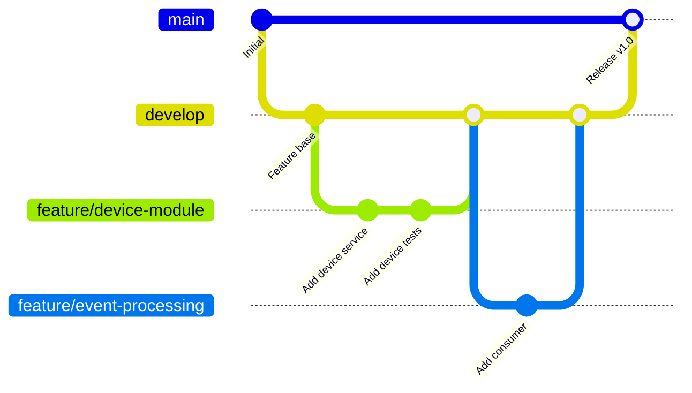

# Git Workflow

## 1. Propósito

Este documento define el flujo de trabajo Git estandarizado para el proyecto SmartAccess IoT Platform. El objetivo es garantizar un historial limpio y trazable, releases predecibles, integración segura de cambios arquitectónicos y compatibilidad con CI/CD.

## 2. Estrategia de Branching

### 2.1 Modelo

El proyecto utiliza un modelo basado en Git Flow simplificado:



### 2.2 Ramas

| Rama | Propósito | Protegida | Merge Desde |
|------|----------|-----------|-------------|
| `main` | Producción estable | Sí | `develop` (vía PR) |
| `develop` | Integración de features | Sí | Feature branches |
| `feature/*` | Desarrollo de funcionalidades | No | — |
| `fix/*` | Correcciones de bugs | No | — |
| `hotfix/*` | Correcciones urgentes en producción | No | — |

### 2.3 Reglas de Protección

| Regla | `main` | `develop` |
|-------|--------|-----------|
| Push directo | Prohibido | Prohibido |
| PR requerido | Sí | Sí |
| CI debe pasar | Sí | Sí |
| Aprobación requerida | 1 mínimo | 1 mínimo |
| Branch up-to-date | Sí | Sí |

## 3. Convenciones de Commits

### 3.1 Formato

Se utiliza Conventional Commits:

```
<type>(<scope>): <subject>

[optional body]

[optional footer]
```

### 3.2 Tipos

| Tipo | Descripción | Ejemplo |
|------|------------|---------|
| feat | Nueva funcionalidad | `feat(device): add status transition validation` |
| fix | Corrección de bug | `fix(consumer): handle null payload` |
| refactor | Reestructuración sin cambio funcional | `refactor(repository): extract base class` |
| test | Agregar o modificar tests | `test(idempotency): add duplicate event test` |
| docs | Solo documentación | `docs(architecture): update event flow diagram` |
| chore | Mantenimiento | `chore(deps): update dependencies` |
| ci | Cambios en CI/CD | `ci: add integration test stage` |

### 3.3 Scopes

| Scope | Módulo |
|-------|--------|
| device | Device Management |
| event | Event Processing |
| consumer | Event Consumer |
| outbox | Outbox Pattern |
| auth | Authentication/Authorization |
| dashboard | Frontend PWA |
| simulator | Device Simulator |
| infra | Infrastructure/Docker |

### 3.4 Reglas

- El subject no debe superar 72 caracteres
- El subject se escribe en tiempo presente e imperativo: "add feature", no "added feature"
- No se utiliza punto final en el subject
- El body se utiliza para explicar el "por qué" si no es obvio

## 4. Flujo de Trabajo

### 4.1 Desarrollo de Feature

```bash
# Crear rama desde develop
git checkout develop
git pull origin develop
git checkout -b feature/device-status-machine

# Desarrollo con commits atómicos
git add .
git commit -m "feat(device): add state machine validation"
git commit -m "test(device): add transition tests"

# Push y PR
git push origin feature/device-status-machine
# Crear PR hacia develop en GitHub
```

### 4.2 Hotfix en Producción

```bash
# Crear rama desde main
git checkout main
git pull origin main
git checkout -b hotfix/fix-consumer-crash

# Corrección
git commit -m "fix(consumer): prevent crash on malformed payload"

# PR hacia main AND develop
git push origin hotfix/fix-consumer-crash
```

### 4.3 Release

```bash
# Merge develop → main
# Crear tag de versión
git tag -a v1.0.0 -m "Release v1.0.0"
git push origin v1.0.0
```

## 5. Versionado

Se utiliza Semantic Versioning (SemVer):

```
MAJOR.MINOR.PATCH
```

| Componente | Cuándo Incrementar |
|-----------|-------------------|
| MAJOR | Cambios incompatibles en API o schema |
| MINOR | Nueva funcionalidad compatible |
| PATCH | Corrección de bugs |

## 6. Pull Requests

### 6.1 Template

```markdown
## Descripción
[Qué hace este PR]

## Tipo de Cambio
- [ ] feat
- [ ] fix
- [ ] refactor
- [ ] test
- [ ] docs

## Testing
- [ ] Tests unitarios
- [ ] Tests de integración

## Schema Changes
- [ ] Incluye migración SQL
```

### 6.2 Criterios de Merge

- CI pasa sin errores
- Al menos 1 aprobación
- Sin conflictos
- Description completa

## 7. Gitignore

```gitignore
# Dependencies
node_modules/

# Environment
.env
.env.local

# Build
dist/
build/

# IDE
.vscode/
.idea/

# OS
.DS_Store
Thumbs.db

# Logs
*.log

# Coverage
coverage/
```
