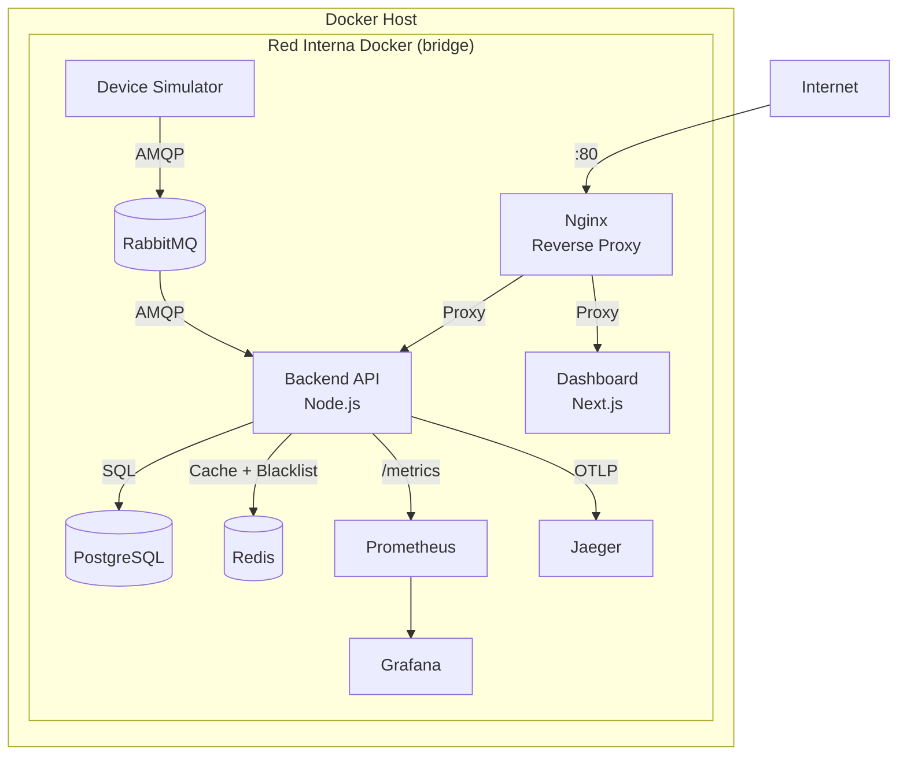

# Infraestructura

## 1. Visión General

SmartAccess se despliega utilizando Docker Compose como herramienta de orquestación. La infraestructura está **hardened** con contenedores de solo lectura, Docker Secrets, y límites de recursos por servicio.

### Diagrama de Infraestructura


```mermaid
flowchart TD
    subgraph VPS["Docker Host"]
        subgraph Network["Red Interna Docker (bridge)"]
            NGINX[Nginx<br>Reverse Proxy]
            API[Backend API<br>Node.js]
            DASH[Dashboard<br>Next.js]
            SIM[Device Simulator]
            PG[(PostgreSQL)]
            RMQ[(RabbitMQ)]
            REDIS[(Redis)]
            PROM[Prometheus]
            GF[Grafana]
            JG[Jaeger]
        end
    end

    INET[Internet] -->|:80| NGINX
    NGINX -->|Proxy| API
    NGINX -->|Proxy| DASH
    SIM -->|AMQP| RMQ
    RMQ -->|AMQP| API
    API -->|SQL| PG
    API -->|Cache + Blacklist| REDIS
    API -->|/metrics| PROM
    PROM --> GF
    API -->|OTLP| JG
```

## 2. Servicios

### 2.1 Catálogo de Servicios

| Servicio | Imagen | Puerto Externo | Puerto Interno | Propósito |
|----------|--------|---------------|---------------|----------|
| nginx | nginx:alpine | 80 | 80 | Proxy reverso + IPv6 |
| backend | build local | — | 3000 | API REST + WebSocket + Consumer AMQP |
| dashboard | build local | — | 3000 | Next.js PWA |
| simulator | build local | — | — | Generación de eventos IoT |
| postgres | postgres:14 | — | 5432 | Base de datos OLTP |
| rabbitmq | rabbitmq:3-management | 15672 | 5672, 15672 | Message broker |
| redis | redis:7-alpine | — | 6379 | Cache + Token Blacklist |
| prometheus | prom/prometheus:latest | 9090 | 9090 | Recolector de métricas |
| grafana | grafana/grafana:latest | 3001 | 3000 | Dashboards |
| jaeger | jaegertracing/all-in-one:latest | 16686 | 16686, 4318 | Distributed tracing |

### 2.2 Configuración de Red

```yaml
networks:
  smartaccess_network:
    driver: bridge
```

Todos los servicios operan en una red Docker interna. Solo Nginx expone puertos al exterior. Los servicios internos se comunican por nombre de servicio (DNS Docker).

### 2.3 Volúmenes

| Volumen | Servicio | Mount Point | Propósito |
|---------|---------|-------------|----------|
| postgres_data | postgres | /var/lib/postgresql/data | Persistencia de datos |
| rabbitmq_data | rabbitmq | /var/lib/rabbitmq | Cola de mensajes |
| redis_data | redis | /data | Cache persistente |
| prometheus_data | prometheus | /prometheus | Métricas históricas (7d retention) |
| grafana_data | grafana | /var/lib/grafana | Dashboards y configuraciones |

## 3. Hardening de Contenedores

### 3.1 read_only: true

**Todos los contenedores** operan con sistema de archivos inmutable. Los procesos solo pueden escribir en particiones `tmpfs` (RAM) explícitamente declaradas:

| Servicio | tmpfs mounts |
|----------|-------------|
| nginx | `/var/cache/nginx`, `/var/run`, `/tmp`, `/etc/nginx/conf.d` |
| backend | `/tmp` |
| simulator | `/tmp` |
| postgres | `/var/run/postgresql`, `/tmp` |
| rabbitmq | `/var/run/rabbitmq`, `/tmp`, `/var/log/rabbitmq` |
| redis | `/tmp` |
| prometheus | `/tmp` |
| grafana | `/var/lib/grafana/csv`, `/var/lib/grafana/png`, `/tmp` |
| jaeger | `/tmp` |

### 3.2 Docker Secrets

Las credenciales se inyectan vía archivos montados en `/run/secrets/` en vez de variables de entorno:

```yaml
secrets:
  db_password:
    file: ./secrets/db_password.txt
  mq_password:
    file: ./secrets/mq_password.txt
  grafana_password:
    file: ./secrets/grafana_password.txt
```

| Servicio | Secret | Variable |
|----------|--------|---------|
| postgres | db_password | `POSTGRES_PASSWORD_FILE=/run/secrets/db_password` |
| backend | db_password, mq_password | Lee archivos desde Node.js |
| simulator | mq_password | Lee archivo desde Node.js |
| grafana | grafana_password | `GF_SECURITY_ADMIN_PASSWORD__FILE=/run/secrets/grafana_password` |

### 3.3 Resource Limits

Cada servicio tiene CPU y RAM limitados para prevenir ataques de denegación de servicio (DoS) y memory leaks:

| Servicio | CPU | RAM |
|----------|-----|-----|
| nginx | 0.2 | 128M |
| backend | 0.5 | 512M |
| simulator | 0.5 | 256M |
| postgres | 1.0 | 1G |
| rabbitmq | 0.5 | 1024M |
| redis | 0.3 | 256M |
| dashboard | 0.5 | 512M |
| prometheus | 0.5 | 512M |
| grafana | 0.4 | 512M |
| jaeger | 0.5 | 512M |

## 4. Health Checks

| Servicio | Comando | Intervalo | Timeout | Retries |
|----------|---------|-----------|---------|---------|
| postgres | `pg_isready -U smartaccess` | 5s | 5s | 5 |
| rabbitmq | `rabbitmq-diagnostics check_running` | 10s | 10s | 15 |

## 5. Seguridad de Red

- Solo Nginx expone puertos al exterior (`:80`)
- Red Docker interna bridge aislada
- Comunicación inter-servicios por nombre de servicio (DNS Docker)
- Nginx resuelve tanto IPv4 como IPv6 (`listen [::]:80`)
- RabbitMQ Management UI solo accesible vía `:15672` (debug)

## 6. Nginx Configuración Base

```nginx
upstream backend {
    server backend:3000;
}

upstream dashboard {
    server dashboard:3000;
}

server {
    listen 80;
    listen [::]:80;

    location /api/ {
        proxy_pass http://backend;
        proxy_set_header Host $host;
        proxy_set_header X-Real-IP $remote_addr;
        proxy_set_header X-Forwarded-For $proxy_add_x_forwarded_for;
    }

    location /ws {
        proxy_pass http://backend;
        proxy_http_version 1.1;
        proxy_set_header Upgrade $http_upgrade;
        proxy_set_header Connection "upgrade";
    }

    location / {
        proxy_pass http://dashboard;
        proxy_set_header Host $host;
    }
}
```

## 7. Fixes de Infraestructura Documentados

Los siguientes problemas fueron resueltos durante el hardening:

| Issue | Causa Raíz | Fix |
|-------|-----------|-----|
| Nginx crash en read_only | Faltaba tmpfs para `/etc/nginx/conf.d` | Agregado al `tmpfs` |
| Next.js SSR fetch error | El container no resolvía `backend:3000` desde browser | Dual-routing: `INTERNAL_API_URL` para SSR, `NEXT_PUBLIC_API_URL` para browser |
| RabbitMQ OOM kill | 512M insuficiente para management plugin | Aumentado a 1024M |
| Node.js IPv6 localhost | Node v18+ resuelve `localhost` a `::1` en Windows | Nginx `listen [::]:80` |

## 8. Backup

| Componente | Mecanismo | Frecuencia |
|-----------|----------|-----------|
| PostgreSQL | `pg_dump` | Diario |
| RabbitMQ | Definiciones exportadas | Semanal |
| Configuración | Versionada en Git | Cada cambio |

## 9. Requisitos de Hardware

| Recurso | Mínimo | Recomendado |
|---------|--------|-------------|
| CPU | 2 vCPU | 4 vCPU |
| RAM | 4 GB | 8 GB |
| Almacenamiento | 40 GB SSD | 80 GB SSD |
| Red | 100 Mbps | 1 Gbps |
