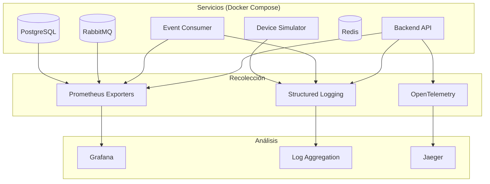

# Observabilidad y Monitoreo

## 1. Visión General

La estrategia de observabilidad se basa en los tres pilares fundamentales adaptados a una arquitectura event-driven (EDA):



### Principios

| Principio | Descripción |
|-----------|-------------|
| Correlación | Todo log y trace incluyen `correlation_id` |
| Formato estructurado | Logs en JSON, métricas en Prometheus format |
| No intrusivo | La observabilidad no impacta el rendimiento del flujo principal |
| Accionable | Toda alerta está vinculada a un runbook |

## 2. Pilar 1: Logs

### 2.1 Formato

Todos los logs se emiten en JSON estructurado. Librería: Winston.

```json
{
  "timestamp": "2025-02-15T14:30:00.123Z",
  "level": "info",
  "service": "event-consumer",
  "correlation_id": "abc-123",
  "event_type": "TELEMETRY_REPORTED",
  "device_id": "dev-001",
  "message": "Event processed successfully",
  "duration_ms": 45
}
```

### 2.2 Niveles

| Nivel | Uso | Ejemplo |
|-------|-----|---------|
| error | Fallo que requiere acción | DB connection lost |
| warn | Anomalía que no bloquea | Retry attempt 3/5 |
| info | Flujo normal significativo | Event processed |
| debug | Detalle de desarrollo | SQL query executed |

### 2.3 Campos Obligatorios

| Campo | Tipo | Descripción |
|-------|------|-------------|
| timestamp | ISO 8601 | UTC obligatorio |
| level | string | error, warn, info, debug |
| service | string | Nombre del servicio emisor |
| correlation_id | UUID | Trazabilidad entre servicios |
| message | string | Descripción del evento |

### 2.4 Campos Contextuales (cuando aplica)

| Campo | Tipo | Descripción |
|-------|------|-------------|
| event_type | string | Tipo de evento procesado |
| device_id | string | Dispositivo relacionado |
| duration_ms | number | Tiempo de procesamiento |
| error_code | string | Código de error |
| retry_attempt | number | Número de reintento |
| queue_name | string | Cola de origen |

## 3. Pilar 2: Métricas

### 3.1 Métricas de Aplicación

| Métrica | Tipo | Labels | Descripción |
|---------|------|--------|-------------|
| events_processed_total | Counter | event_type, status | Total de eventos procesados |
| events_processing_duration | Histogram | event_type | Latencia de procesamiento |
| events_retry_total | Counter | event_type, attempt | Reintentos realizados |
| events_dlq_total | Counter | event_type | Eventos enviados a DLQ |
| events_duplicate_total | Counter | — | Duplicados detectados |
| ws_connections_active | Gauge | — | Conexiones WebSocket activas |

### 3.2 Métricas de Infraestructura

| Métrica | Tipo | Fuente | Descripción |
|---------|------|--------|-------------|
| rabbitmq_queue_messages | Gauge | RabbitMQ exporter | Mensajes en cola |
| rabbitmq_consumers | Gauge | RabbitMQ exporter | Consumers conectados |
| pg_active_connections | Gauge | PostgreSQL exporter | Conexiones activas |
| pg_database_size | Gauge | PostgreSQL exporter | Tamaño de base de datos |

### 3.3 Endpoint

El backend expone métricas en `/metrics` en formato Prometheus.

## 4. Pilar 3: Tracing

### 4.1 Instrumentación

El sistema utiliza OpenTelemetry para tracing distribuido. Cada evento sigue un flujo completo:

```
Device Simulator → RabbitMQ → Consumer → PostgreSQL → WebSocket
```

Cada span incluye:
- `correlation_id`
- `event_type`
- `device_id`
- Duración de cada operación

### 4.2 Herramienta

Jaeger se utiliza para visualización de traces. Se despliega como servicio adicional en Docker Compose.

## 5. Grafana Dashboards

### 5.1 Dashboard: Event Processing

| Panel | Tipo | Query |
|-------|------|-------|
| Events/Second | Time Series | `rate(events_processed_total[5m])` |
| Error Rate | Stat | `events_processed_total{status="failed"} / events_processed_total` |
| Processing Latency p95 | Heatmap | `histogram_quantile(0.95, events_processing_duration)` |
| DLQ Count | Stat | `events_dlq_total` |
| Retry Rate | Bar | `rate(events_retry_total[5m])` |

### 5.2 Dashboard: Infrastructure

| Panel | Tipo | Query |
|-------|------|-------|
| RabbitMQ Queue Depth | Time Series | `rabbitmq_queue_messages` |
| PostgreSQL Connections | Gauge | `pg_active_connections` |
| System CPU | Time Series | `node_cpu_seconds_total` |
| System Memory | Time Series | `node_memory_MemAvailable_bytes` |

## 6. Alertas

### 6.1 Reglas

| Alerta | Condición | Severidad | Canal |
|--------|----------|-----------|-------|
| High Error Rate | Error rate > 5% por 5 min | CRITICAL | Webhook |
| Queue Depth | > 1000 mensajes por 10 min | WARNING | Webhook |
| Consumer Down | 0 consumers por 2 min | CRITICAL | Webhook |
| High Latency | p95 > 1s por 5 min | WARNING | Webhook |
| DLQ Growth | > 10 eventos/hora | WARNING | Webhook |
| DB Connection Exhaustion | > 80% max connections | CRITICAL | Webhook |

### 6.2 Escalamiento

| Severidad | Tiempo de Respuesta | Acción |
|-----------|-------------------|--------|
| CRITICAL | < 15 min | Investigación inmediata + runbook |
| WARNING | < 1 hora | Revisión y evaluación |
| INFO | Próximo ciclo | Registro para análisis |

## 7. Health Checks

Cada servicio expone un endpoint `/health` con la siguiente estructura:

```json
{
  "service": "backend",
  "status": "healthy",
  "timestamp": "2025-02-15T14:30:00Z",
  "checks": {
    "database": "ok",
    "rabbitmq": "ok",
    "redis": "ok"
  },
  "uptime_seconds": 86400
}
```

| Check | Criterio de fallo |
|-------|------------------|
| database | No se puede ejecutar `SELECT 1` |
| rabbitmq | No se puede establecer conexión AMQP |
| redis | No se puede ejecutar `PING` |

## 8. Retención de Datos

| Tipo | Retención | Almacenamiento |
|------|-----------|---------------|
| Logs | 30 días | Archivos locales |
| Métricas | 90 días | Prometheus TSDB |
| Traces | 7 días | Jaeger |
| Eventos inmutables | Indefinido | PostgreSQL |
