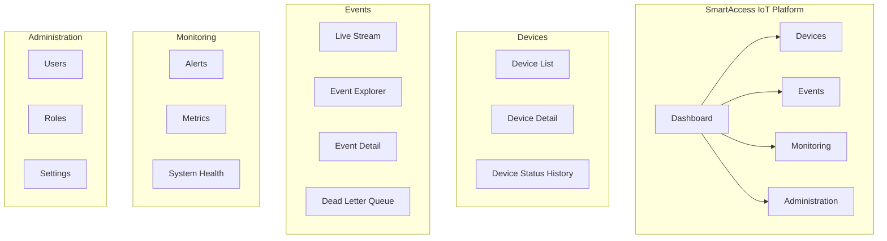
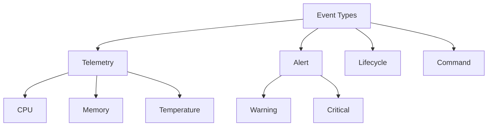
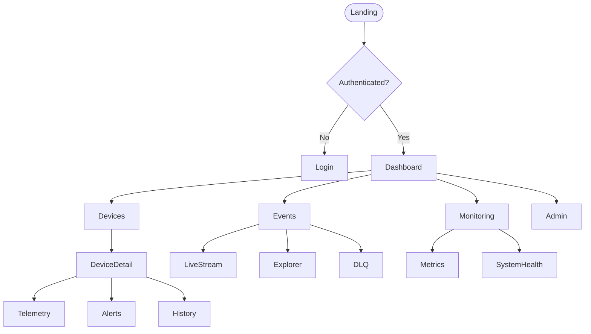
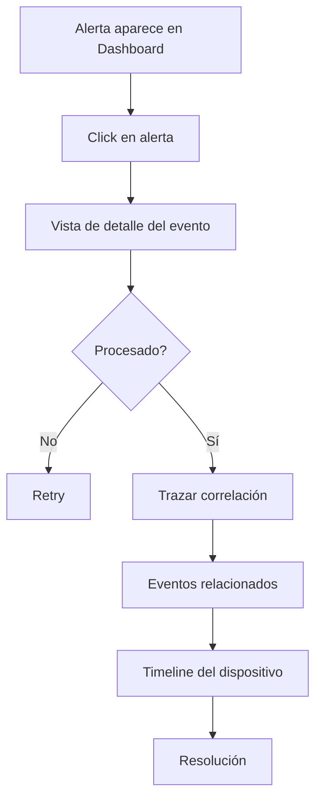

# Arquitectura de Información

## 1. Visión General

SmartAccess organiza su contenido bajo el principio de visibilidad inmediata de eventos críticos con mínima fricción cognitiva, priorizando monitoreo en tiempo real, trazabilidad y claridad operativa.

La arquitectura de información soporta:

- Múltiples tipos de eventos (telemetría, alertas, ciclo de vida)
- Simulación de dispositivos IoT
- Usuarios con distintos roles (ADMIN, OPERATOR, VIEWER)
- Escalabilidad modular (EDA + Broker)

### Principios Rectores

| Principio | Aplicación | Métrica de Validación |
|-----------|-----------|----------------------|
| Jerarquía por dominio de negocio | Secciones organizadas por Devices, Events, Monitoring, Administration | ≤ 3 clics para acceder a un evento específico |
| Orientación a tiempo real | Dashboard centrado en streams y estado actual | Eventos visibles en < 2 segundos tras emisión |
| Trazabilidad completa | Historial de eventos y transiciones accesible desde cada entidad | 100% eventos vinculados a device_id |
| Consistencia terminológica | Uso uniforme de "Event", "Device", "Alert", "Consumer" | Sin ambigüedad semántica |
| Escalabilidad modular | Nuevos tipos de evento se agregan sin alterar jerarquía | Nueva categoría añadible sin reorganización |

## 2. Modelo de Organización del Contenido

### 2.1 Estructura General

### 2.2 Patrón de Organización

| Patrón | Aplica | Justificación |
|--------|--------|--------------|
| Jerárquico (Árbol) | Sí | Estructura clara por dominio |
| Secuencial (Lineal) | Parcial | Solo para flujos como registro de dispositivo |
| Por Facetas (Taxonomía) | Sí | Filtros por tipo, severidad, estado |

## 3. Sistemas de Navegación

| Tipo | Ubicación | Propósito | Ejemplo |
|------|-----------|----------|---------|
| Global | Sidebar izquierda | Secciones principales | Dashboard, Devices, Events |
| Local | Tabs internas | Navegación dentro de entidad | Device → Telemetry / Alerts |
| Contextual | Botones inline | Acciones específicas | Retry Event |
| Búsqueda | Header | Acceso directo por ID | Search by device_id |

### Breadcrumbs

Patrón: `Dashboard > Devices > Device-ABC123 > Telemetry`

| Componente | Regla |
|-----------|-------|
| Separador | `>` |
| Clickable | Todos excepto el último nivel |
| Máximo niveles | 5 |
| Accesibilidad | `<nav aria-label="breadcrumb">` |

## 4. Sistemas de Etiquetado

### 4.1 Convenciones

| Elemento | Convención | Correcto | Incorrecto |
|----------|-----------|----------|-----------|
| Menú principal | Sustantivos singulares | Device | Devices Management Section |
| Botones | Verbo infinitivo | Retry | Retrying Process |
| Títulos | Entidad + contexto | Event Detail | Event Info Page |
| Formularios | Label obligatorio | Device ID | Placeholder sin label |

### 4.2 Glosario de Términos

| Término | Definición | Contexto |
|---------|-----------|---------|
| Device | Entidad emisora de eventos | IoT simulator |
| Event | Mensaje publicado al broker | Telemetry, Alert |
| Telemetry | Evento informativo periódico | CPU, temperatura |
| Alert | Evento con severidad | Breach de umbral |
| Consumer | Servicio que procesa eventos | Backend worker |
| Dead Letter | Evento fallido permanentemente | Retry agotado |

## 5. Búsqueda e Indexación

### 5.1 Alcance

| Contenido | Indexado | Peso |
|-----------|---------|------|
| Event ID | Sí | Alto |
| Device ID | Sí | Alto |
| Event Type | Sí | Medio |
| Payload JSON | Parcial | Medio |

### 5.2 Filtros Disponibles

- Event Type (enum)
- Severity (enum)
- Processing Status (received, processed, failed)
- Date Range
- Device ID
- Correlation ID

## 6. Taxonomía de Eventos

### Metadatos del Evento

| Metadato | Tipo | Obligatorio | Propósito |
|----------|------|------------|----------|
| event_id | UUID | Sí | Identificador único |
| device_id | UUID | Sí | FK hacia device |
| event_type | Enum | Sí | Categorización |
| severity | Enum | Condicional | Solo para alerts |
| payload | JSONB | Sí | Datos estructurados |
| correlation_id | UUID | Condicional | Trazabilidad |
| processing_status | Enum | Sí | Estado de procesamiento |

### Relaciones

| Relación | Descripción |
|----------|-------------|
| Device **hasMany** Events | Un dispositivo genera múltiples eventos |
| Event **belongsTo** Device | Todo evento pertenece a un dispositivo |
| Event **mayGenerate** Alert | Un evento puede disparar una alerta |
| Device **hasStateTransitions** | El dispositivo mantiene historial de estados |

## 7. Sitemap

### Estructura de URLs

| Nivel | Patrón | Ejemplo |
|-------|--------|---------|
| Root | `/` | `/` |
| Section | `/devices` | `/events` |
| Detail | `/devices/:device-id` | `/events/:event-id` |
| Action | `/events/:id/retry` | — |

Reglas: kebab-case, minúsculas, RESTful.

## 8. Flujo Clave: Inspección de Evento Crítico

## 9. Accesibilidad

- Navegación 100% por teclado
- ARIA landmarks definidos en todas las secciones
- Estados de foco visibles
- Contraste WCAG 2.1 AA
- Live regions (`aria-live="polite"`) para eventos en tiempo real

## 10. Métricas de Arquitectura de Información

| Métrica | Objetivo |
|---------|----------|
| Tiempo para localizar evento | < 20 segundos |
| Éxito en búsqueda | > 90% |
| Abandono en inspección crítica | < 15% |
| Latencia de visualización en dashboard | < 2s |
