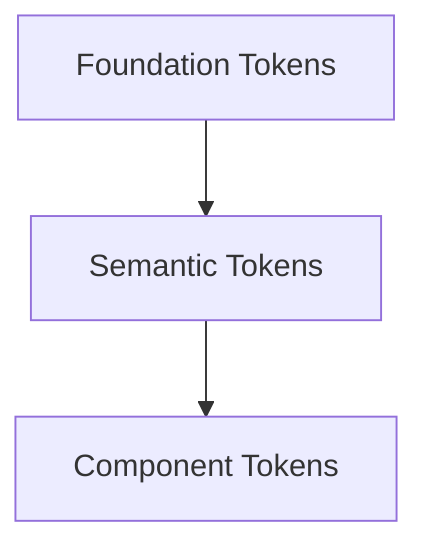
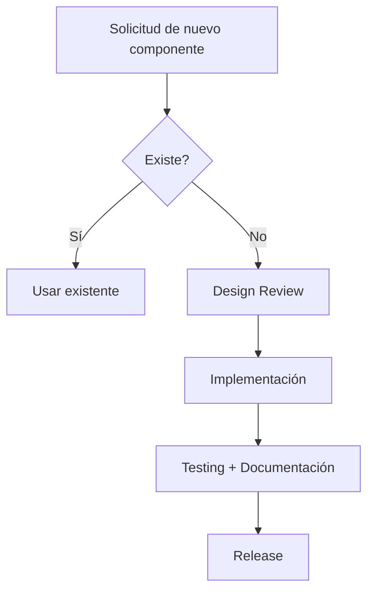

# Estrategia del Sistema de Diseño

## 1. Visión y Propósito

### 1.1 Declaración de Visión

El sistema de diseño **RealTimeOps** constituye el lenguaje visual y funcional unificado de la plataforma de monitoreo orientada a eventos. Está diseñado para optimizar la supervisión en tiempo real de dispositivos IoT a través de componentes resilientes, accesibles y orientados a datos, permitiendo a operadores técnicos detectar, comprender y actuar sobre eventos críticos en segundos.

### 1.2 Propósito Estratégico

| Dimensión | Objetivo | Impacto |
|-----------|---------|---------|
| Eficiencia operativa | Reducir tiempo de interpretación de eventos críticos | -50% en tiempo de reacción ante alertas |
| Consistencia visual | Unificar estados, severidades y notificaciones | 100% de eventos representados con patrones estándar |
| Escalabilidad | Soportar crecimiento en volumen de eventos | UI preparada para 10x eventos sin rediseño |
| Accesibilidad | Garantizar legibilidad en contextos críticos | WCAG 2.1 AA en todos los componentes |
| Confiabilidad percibida | Transmitir estabilidad incluso ante fallos | Reducción de abandono en reconexiones > 30% |

## 2. Principios de Diseño

| Principio | Definición | Criterio de Aplicación |
|-----------|-----------|----------------------|
| Signal Over Noise | La información crítica se destaca sobre el ruido operativo | Las alertas críticas se identifican en < 3 segundos |
| State is Explicit | Todo estado (loading, offline, retrying, failed) es visible | El usuario conoce exactamente qué ocurre en cada momento |
| Resilience First UX | La interfaz anticipa fallos y comunica recuperación | Existe feedback claro ante desconexión |
| Density Without Chaos | Alta densidad de datos sin sobrecarga cognitiva | La jerarquía visual es clara |
| Consistency Builds Trust | Estados y severidades usan siempre el mismo patrón | Mismo estilo de alerta en todas las pantallas |
| Performance Perception | La experiencia se percibe rápida incluso con latencia | Se utilizan skeletons en cargas críticas |

### Principios Rectores

- En sistemas en tiempo real, la claridad tiene prioridad sobre la estética
- Los estados son siempre explícitos, nunca implícitos
- La resiliencia técnica se refleja en resiliencia visual
- El operador no debe adivinar qué ocurre en el sistema
- Las alertas son jerárquicas, no dramáticas
- Las animaciones innecesarias no agregan valor en entornos críticos
- El diseño contempla el comportamiento offline

## 3. Métricas

### 3.1 OKRs del Sistema de Diseño

| Objetivo | Key Result | Meta |
|----------|-----------|------|
| Reducir tiempo de interpretación | Tiempo promedio para identificar alerta crítica | < 5 segundos |
| Aumentar adopción del DS | Porcentaje de componentes reutilizados | > 90% |
| Mejorar experiencia de reconexión | Tasa de recuperación exitosa percibida | > 95% |
| Garantizar accesibilidad | Componentes con testing automatizado a11y | 100% |

### 3.2 Métricas Técnicas

| Métrica | Fórmula | Objetivo |
|---------|---------|----------|
| Adoption Rate | (DS Components / Total UI Components) × 100 | > 90% |
| State Coverage | Componentes con estados definidos | 100% |
| Reusability Index | Instancias por componente | Top 10 > 30 usos |

### 3.3 Métricas de Experiencia

| Métrica | Definición | Objetivo |
|---------|-----------|----------|
| Time to Recognize Critical Alert | Tiempo hasta identificar alerta severa | < 5s |
| Task Completion Rate | Porcentaje de tareas operativas completadas sin error | > 90% |
| Error Recovery Rate | Porcentaje de usuarios que completan flujo tras error | > 85% |

## 4. Audiencia

### 4.1 Usuarios Primarios

| Rol | Necesidad Principal | Resultado Esperado |
|-----|-------------------|-------------------|
| Operador Técnico | Detectar eventos críticos rápidamente | Alertas jerárquicas claras |
| Desarrollador Frontend | Componentes consistentes para estados complejos | Librería con estados predefinidos |
| Backend Developer | Visualización clara de eventos | Trazabilidad visual |
| QA | Casos de test repetibles | Estados predefinidos |

## 5. Arquitectura de Tokens

### 5.1 Niveles



### 5.2 Spacing Scale

| Token | Valor |
|-------|-------|
| space-0 | 0 |
| space-1 | 4px |
| space-2 | 8px |
| space-3 | 12px |
| space-4 | 16px |
| space-5 | 24px |
| space-6 | 32px |
| space-7 | 48px |
| space-8 | 64px |

No se permiten valores intermedios entre los tokens definidos.

### 5.3 Colores de Severidad

| Token | Light | Dark | Uso |
|-------|-------|------|-----|
| color-severity-critical | #dc2626 | #f87171 | Alertas críticas |
| color-severity-warning | #f59e0b | #fbbf24 | Advertencias |
| color-severity-info | #2563eb | #3b82f6 | Información |
| color-severity-success | #16a34a | #22c55e | Confirmaciones |
| color-surface | #ffffff | #0f172a | Fondo |
| color-text-primary | #0f172a | #f8fafc | Texto |

## 6. Gobernanza

### 6.1 Flujo de Componentes



### 6.2 Roles

| Rol | Responsabilidad |
|-----|----------------|
| DS Lead | Estrategia y visión |
| Core Dev | Implementación |
| QA | Validación de estados |

## 7. Integración con Arquitectura de Información

| Patrón IA | Componente DS | Uso |
|----------|--------------|-----|
| Global Navigation | TopNav, Sidebar | Navegación principal |
| Event Stream | EventList, EventRow | Eventos en tiempo real |
| Alert Center | AlertPanel | Gestión de alertas |
| Device Detail | DeviceCard, TelemetryChart | Vista detallada |
| System Status | StatusBanner | Estado global |

## 8. Estructura de Documentación

```
docs/design-system/
├── README.md
├── foundations/
├── components/
├── patterns/
├── resilience/
└── contributing.md
```
