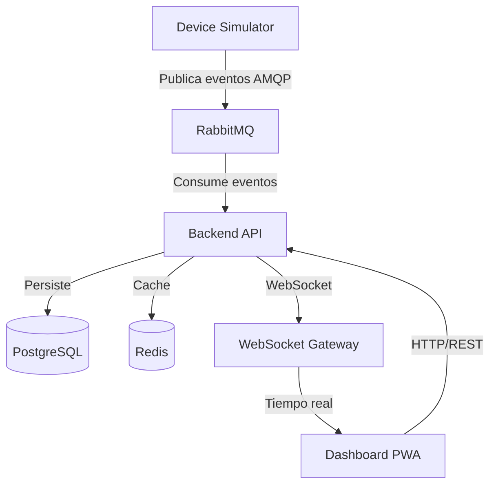

# Arquitectura del Sistema

## 1. Descripción General

SmartAccess IoT Platform es un sistema de monitoreo de dispositivos IoT en tiempo real basado en Event-Driven Architecture (EDA). El sistema recibe eventos de dispositivos simulados, los procesa de forma resiliente mediante un message broker, los persiste en una base de datos OLTP normalizada y proyecta el estado actual en un dashboard en tiempo real.

### Diagrama de Contexto (C4 — Nivel 1)



### Componentes del Sistema

| Componente | Responsabilidad | Tecnología |
|-----------|----------------|-----------|
| Device Simulator | Genera eventos IoT simulados con comportamiento realista | Node.js + TypeScript |
| Message Broker | Enrutamiento y entrega confiable de eventos | RabbitMQ (AMQP) |
| Backend API | Procesamiento de eventos, lógica de negocio, API REST | Node.js + TypeScript |
| PostgreSQL | Persistencia OLTP con integridad referencial | PostgreSQL 14+ |
| Redis | Cache de estado y sesiones | Redis 7+ |
| WebSocket Gateway | Proyección en tiempo real al frontend | Integrado en Backend |
| Dashboard PWA | Visualización en tiempo real con soporte offline | Next.js + TypeScript |
| Nginx | Proxy reverso, TLS termination, routing | Nginx |

## 2. Decisiones Arquitectónicas

### 2.1 Event-Driven Architecture (EDA)

El sistema se basa en eventos de dominio:

- `DEVICE_CONNECTED`
- `DEVICE_DISCONNECTED`
- `TELEMETRY_REPORTED`
- `ALERT_TRIGGERED`
- `COMMAND_RECEIVED`
- `COMMAND_EXECUTED`

**Flujo de eventos:**

1. El simulador publica eventos al broker (RabbitMQ)
2. Los consumers procesan los eventos con ACK manual
3. Los eventos se persisten en PostgreSQL dentro de una transacción
4. El estado se proyecta al dashboard vía WebSocket

**Justificación:** EDA permite desacoplar la generación de eventos de su procesamiento, habilita resiliencia ante fallos (el broker retiene mensajes si el consumer cae) y soporta procesamiento asíncrono.

### 2.2 Monolito Modular

El backend se organiza por bounded contexts internos:

- **Device Management Module** — Registro y gestión de dispositivos
- **Telemetry Module** — Procesamiento de datos de telemetría
- **Alert Module** — Detección y gestión de alertas
- **Event Store Module** — Persistencia y consulta de eventos
- **Outbox Module** — Publicación confiable de eventos
- **Authentication Module** — JWT, RBAC, sesiones

Cada módulo:

- Posee su propio dominio
- No accede directamente a tablas de otros módulos
- Se comunica mediante eventos internos

Esta organización permite una futura migración a microservicios si fuera necesario, sin cambios en la lógica de dominio.

### 2.3 Comunicación

| Tipo | Protocolo | Uso |
|------|----------|-----|
| Asíncrona | AMQP (RabbitMQ) | Eventos de dispositivos |
| Síncrona | HTTP/REST | API del dashboard |
| Tiempo real | WebSocket | Actualizaciones al frontend |

## 3. Estrategia de Resiliencia

### 3.1 At-Least-Once Delivery con Idempotencia

El broker garantiza entrega al menos una vez. Para evitar efectos duplicados, cada evento incluye un `idempotency_key` con constraint UNIQUE en PostgreSQL. Si un evento duplicado es recibido, el consumer lo descarta y registra la auditoría correspondiente.

### 3.2 ACK Manual

El consumer confirma (ACK) el mensaje solo después del commit exitoso en base de datos. Si el procesamiento falla, no se envía ACK y el broker reentrega el mensaje.

```
Evento recibido → Validación → Persistencia (TX) → Commit → ACK al broker
                                    ↓ (fallo)
                               No ACK → Broker reentrega
```

### 3.3 Retry con Backoff Exponencial

Los eventos fallidos se reintentan con backoff exponencial hasta un máximo configurable (default: 5 intentos). La fórmula de delay es:

```
delay = base_delay * 2^(attempt - 1)
```

### 3.4 Dead Letter Queue (DLQ)

Los eventos que superan el límite de reintentos se mueven a una Dead Letter Queue dedicada. Estos eventos se persisten en la tabla `dead_letter_events` para análisis posterior.

### 3.5 Outbox Pattern

Para garantizar consistencia entre la base de datos y el broker:

1. El evento se almacena en la tabla `outbox_events` dentro de la misma transacción que la operación de negocio
2. Un worker background consulta eventos pendientes (`published = FALSE`)
3. El worker publica al broker y marca el evento como publicado
4. Si el proceso se interrumpe, el worker retoma los eventos pendientes en el siguiente ciclo

### 3.6 Reconexión Automática

- **Broker:** El backend implementa reconexión automática al broker con backoff exponencial
- **WebSocket:** El frontend implementa reconexión automática con sincronización de estado al reconectar
- **PWA Offline:** IndexedDB almacena datos localmente y sincroniza al recuperar conexión

## 4. Persistencia

### 4.1 PostgreSQL (OLTP)

Diseño normalizado (3NF+) optimizado para escritura intensiva de eventos:

- Enums para estados y tipos (sin strings libres)
- Foreign keys con políticas ON DELETE/ON UPDATE explícitas
- Indexes para consultas frecuentes (device_id, processing_status, received_at)
- GIN indexes para consultas JSONB
- Partial indexes para outbox pendiente
- Constraints CHECK para validación a nivel de datos
- Triggers para validación de transiciones de estado y auditoría automática

### 4.2 Redis

- Cache de estado actual de dispositivos
- Gestión de sesiones
- Rate limiting

## 5. Frontend (PWA)

### 5.1 Características

- Dashboard en tiempo real con WebSocket
- Soporte offline via Service Workers
- Cache local con IndexedDB
- Reconexión automática con sincronización de estado

### 5.2 Estrategia de Cache

| Recurso | Estrategia |
|---------|-----------|
| Assets estáticos (CSS, JS) | Cache-first |
| Datos de eventos | Network-first |
| Estado de dispositivos | Stale-while-revalidate |

## 6. Seguridad

| Aspecto | Implementación |
|---------|---------------|
| Transporte | TLS 1.3 via Nginx (HSTS habilitado) |
| Autenticación | JWT con firma segura |
| Autorización | RBAC (ADMIN, OPERATOR, VIEWER) |
| Secretos | Variables de entorno, GitHub Secrets |
| Red | Firewall, red interna Docker aislada |
| Datos | Cifrado en reposo (full disk encryption) |

## 7. Observabilidad

| Pilar | Herramienta | Alcance |
|-------|------------|---------|
| Logs | Winston (JSON estructurado) | Todos los servicios |
| Métricas | Prometheus + Grafana | HTTP, broker, DB, eventos |
| Tracing | OpenTelemetry + Jaeger | Flujo completo de eventos |
| Health Checks | Endpoints `/health` | Todos los servicios |