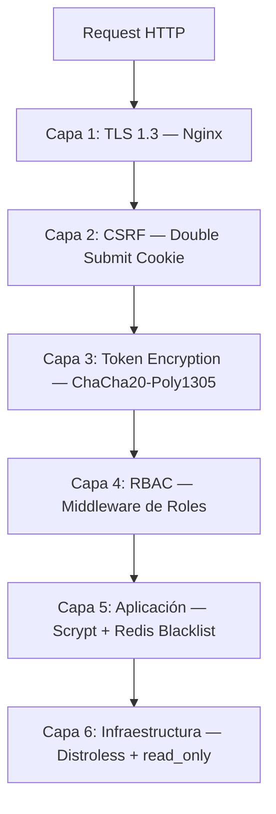

# Seguridad

## 1. Modelo de Seguridad por Capas

SmartAccess implementa un modelo de defensa en profundidad con 6 capas de seguridad independientes. Cada capa opera de forma aislada — la falla de una no compromete a las demás.

## 2. Autenticación

### 2.1 Token Encryption (PASETO-inspired)

Los tokens **no son JWT estándar**. Se encriptan con ChaCha20-Poly1305 + HKDF, haciendo el payload completamente inaccesible sin la clave maestra.

| Aspecto | Implementación |
|---------|---------------|
| Algoritmo | ChaCha20-Poly1305 (AEAD) |
| Derivación de clave | HKDF desde master secret |
| Formato | `version.nonce_hex.ciphertext_hex.tag_hex` |
| Librería | `node:crypto` nativo |

**Referencia:** [ADR-001: Token Encryption](../adr/001-token-encryption.md)

### 2.2 HttpOnly Cookies

Los tokens se transportan exclusivamente en cookies, **nunca** en `localStorage` ni en headers `Authorization` desde el browser:

| Cookie | Contenido | Flags |
|--------|-----------|-------|
| `access-token` | Token de acceso encriptado | HttpOnly, SameSite=Strict, Secure, Path=/ |
| `refresh-token` | Token de refresh encriptado | HttpOnly, SameSite=Strict, Secure, Path=/api/auth |
| `csrf-token` | Token CSRF | SameSite=Strict, Secure (NO HttpOnly) |

El `csrf-token` **no es HttpOnly** — el JavaScript del cliente lo lee y lo envía como header `X-CSRF-Token`.

### 2.3 CSRF Protection

Implementación del patrón **Double-Submit Cookie**:

1. El servidor genera un token CSRF y lo envía como cookie `csrf-token`
2. El cliente lee la cookie y la envía en el header `X-CSRF-Token`
3. El servidor valida que cookie y header coincidan
4. Un atacante en otro dominio no puede leer la cookie (SameSite=Strict)

### 2.4 Password Hashing

| Aspecto | Implementación |
|---------|---------------|
| Algoritmo | Scrypt (memory-hard) |
| Librería | `node:crypto` nativo |
| Salt | 32 bytes aleatorios |
| Key length | 64 bytes |
| Formato | `salt_hex:hash_hex` |

**Referencia:** [ADR-002: Password Hashing](../adr/002-password-hashing.md)

## 3. Autorización

### 3.1 RBAC (Role-Based Access Control)

| Rol | Permisos |
|-----|---------|
| ADMIN | Full access — CRUD de todos los recursos |
| OPERATOR | Lectura de todos los recursos + acknowledge alerts |
| VIEWER | Solo lectura |

El middleware de RBAC se aplica **por ruta**, no por controller. Cada endpoint declara explícitamente qué roles tienen acceso.

## 4. Revocación de Tokens

### 4.1 Redis Token Blacklist

Para invalidar tokens antes de su expiración (logout, compromiso de cuenta):

1. Al hacer logout, el token se agrega a un set en Redis
2. Cada request verifica si el token está en el blacklist
3. El TTL del entry en Redis coincide con la expiración del token
4. Si Redis cae, el sistema **deniega** por defecto (fail-closed)

### 4.2 Graceful Degradation

El `TokenBlacklistService` implementa degradación graciosa:

- Si Redis está disponible → verifica blacklist normalmente
- Si Redis no responde → trata el token como revocado (seguridad por defecto)
- Logs de warning cuando Redis falla

## 5. Seguridad de Infraestructura

### 5.1 Docker Hardening

| Medida | Alcance | Detalle |
|--------|---------|---------|
| Distroless | Backend, Simulator | Sin shell, sin herramientas, sin gestor de paquetes |
| read_only | 9/10 servicios | Sistema de archivos inmutable |
| Docker Secrets | 4 servicios | Credenciales en `/run/secrets/` |
| Resource Limits | 10 servicios | CPU y RAM limitados |
| tmpfs | 9 servicios | Solo carpetas temporales en RAM |

**Referencia:** [ADR-004: Container Hardening](../adr/004-container-hardening.md)

### 5.2 Red

- Solo Nginx expone puertos al exterior (`:80`)
- Red Docker bridge interna aislada
- Nginx resuelve IPv4 e IPv6 (`listen [::]:80`)
- Servicios internos no son accesibles desde el host

## 6. Resumen de Vectores Mitigados

| Vector | Mitigación |
|--------|-----------|
| XSS robo de tokens | HttpOnly cookies — JavaScript no puede acceder |
| CSRF | Double-Submit Cookie + SameSite=Strict |
| Token interception | ChaCha20-Poly1305 — payload inaccesible |
| Brute force passwords | Scrypt (memory-hard) — slow by design |
| Token reuse post-logout | Redis Blacklist con TTL |
| Container escape | Distroless — sin shell ni herramientas |
| Filesystem tampering | read_only — inmutable |
| Credential exposure | Docker Secrets — no visibles en env vars |
| DoS / Memory leak | Resource limits por servicio |
| Privilege escalation | RBAC por ruta + principio de menor privilegio |
